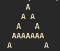

# mEmE rEpository


~~I just print big E using small E's~~
I am a powerful Enterprise-level function/CLI tool for generating BIG E's with small E's and BIG A's with small A's.

## How to build
Your standard Cmake project.
1. Create build directory.
2. run:
```bash
cmake -S . -B <your_build_dir>
cmake --build <your_build_dir>
```

## How to use E
Just run the function e_e(height_of_your_e, width_of_your_e) and have fun!

## How to use A
Run a [height] [line_width]

## Results

### E
For e_e(5,1) you get 


For e_e(30,7) you get 


### A

For a 5 1 you get



For a 30 7 you get


Its so cool isn't it?